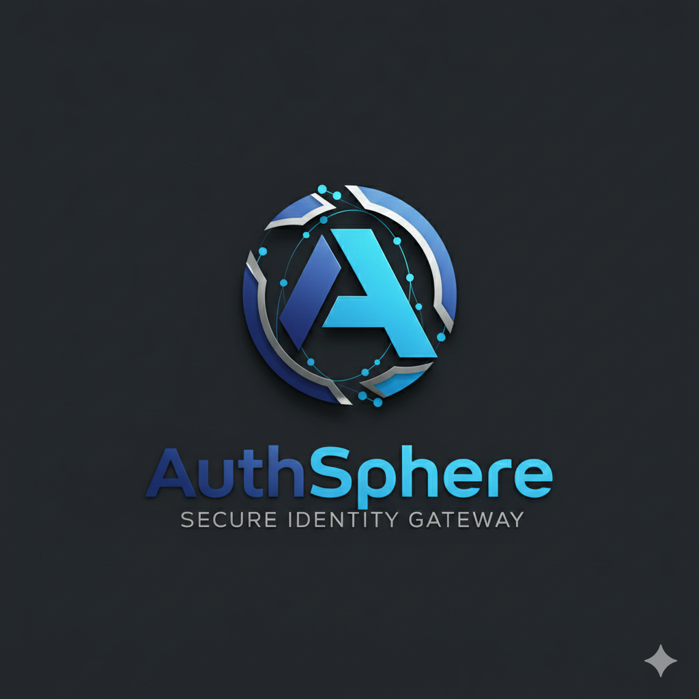
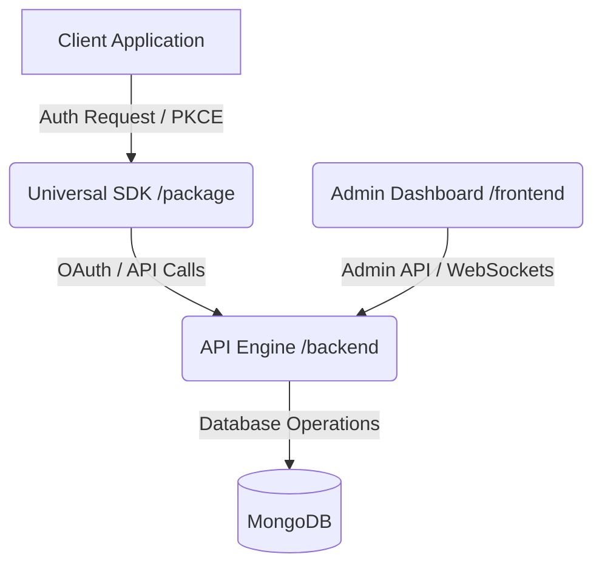

<div align="center">
  

# AuthSphere

Open-source Identity and Access Management (IAM) engine with native PKCE and multi-tenant isolation.

[](https://github.com/madhav9757/AuthSphere)
[](https://www.npmjs.com/package/@authspherejs/sdk)
[](https://github.com/madhav9757/AuthSphere/blob/main/LICENSE)
[](https://auth-sphere-gilt.vercel.app/)

<p align="center">
  <a href="https://auth-sphere-gilt.vercel.app/">Live Demo</a> •
  <a href="#setup">Setup</a> •
  <a href="#documentation">Documentation</a> •
  <a href="CONTRIBUTING.md">Contributing</a>
</p>
</div>

---

## Overview

Traditional authentication tightly couples identity code to business logic, requiring your application to handle password hashing, session state, and email generation. This approach increases the attack surface and development overhead.

AuthSphere abstracts identity management into a standalone service. Your application delegates the authentication lifecycle—including OAuth handshakes, OTP generation, and token signing—to AuthSphere, and receives cryptographically verified JWTs.

## Features

- **Multi-Tenant Isolation**: Cryptographically isolated environments (e.g., Staging vs. Prod) with strict audit logging.
- **Protocol Support**: Native OAuth 2.0 and OpenID Connect (OIDC) with enforced PKCE S256.
- **Email Branding**: Email template editor with live previews.
- **Live Telemetry**: WebSockets stream authentication events and diagnostics directly to the admin dashboard.
- **Identity Management**: Granular control over account blocking, verification overrides, and record purging.
- **OAuth Providers**: Out-of-the-box support for Google, GitHub, and Discord.

## Architecture

AuthSphere is organized as a modular monorepo separated into four core layers:



## Setup

Deploy the entire stack via Docker for local testing:

```bash
# 1. Clone the repository
git clone https://github.com/madhav9757/AuthSphere.git
cd AuthSphere

# 2. Configure environment variables
cp backend/.env.example backend/.env

# 3. Launch the stack
docker-compose up --build
```

- **Admin Dashboard:** `http://localhost:3000`
- **API Engine:** `http://localhost:8000`

For manual local development steps, see the [Contributing Guide](CONTRIBUTING.md).

## Usage

Integrating AuthSphere requires the client SDK.

**1. Install the SDK**
```bash
npm install @authspherejs/sdk
```

**2. Initialize**
```javascript
import AuthSphere from "@authspherejs/sdk";

AuthSphere.initAuth({
  publicKey: "YOUR_PROJECT_PUB_KEY",
  projectId: "YOUR_PROJECT_ID", 
  redirectUri: window.location.origin + "/callback", 
  baseUrl: "https://auth-sphere-6s2v.vercel.app", 
});
```

**3. Trigger Login**
```javascript
AuthSphere.redirectToLogin("google");
```

## Documentation

Detailed technical documentation is available in the `/docs` directory:

- [Architecture & Design](docs/architecture.md)
- [Security Specifications](docs/security.md)
- [API Reference](docs/api.md)
- [SDK Integration Guide](docs/sdk.md)
- [Deployment Guide](docs/deployment.md)

## Tech Stack

| Component         | Technologies                              |
| ----------------- | ----------------------------------------- |
| **Frontend**      | React 19, Vite, Tailwind v4, Zustand      |
| **Backend**       | Node.js, Express, MongoDB, Socket.io      |
| **Security**      | Argon2id/Bcrypt, RSA-2048, AES-256-GCM    |

## Roadmap

- [x] Core Authentication Engine
- [x] Admin Dashboard
- [x] TypeScript SDK
- [ ] WebAuthn / Passkey Support
- [ ] Advanced Webhooks integration
- [ ] Multi-region sync capabilities

## Contributing & Security

- **Contributing**: Please see our [Contributing Guide](CONTRIBUTING.md) for local development setup and guidelines.
- **Security**: If you discover a vulnerability, refer to our [Security Policy](SECURITY.md) for reporting instructions.

---
<div align="center">
  <p>Licensed under the <a href="./LICENSE">MIT License</a>.</p>
</div>
